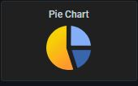

#########################################################################################
# SCENARIO 3: Configure Grafana & make your first graph
#########################################################################################

**GOAL:**  
Prometheus does not allow you to create a graph with different metrics, you need to use Grafana for that.  
Installing Prometheus with Helm also comes with this tool.  
We will learn how to access Grafana, and configure a graph.

## A. Expose Grafana

With Grafana, we are facing the same issue than with Prometheus with regards to accessing it.

```bash
$ kubectl get -n monitoring svc -l app.kubernetes.io/name=grafana
NAME                    TYPE        CLUSTER-IP     EXTERNAL-IP   PORT(S)   AGE
prom-operator-grafana   ClusterIP   10.103.48.66   <none>        80/TCP    30m
```

We will then modify its service in order to access it from anywhere in the lab, with a *LoadBalancer* configuration.  
As Grafana's port is already 80, we only need to update the type of this service.  

```bash
$ kubectl patch -n monitoring svc prom-operator-grafana  -p '{"spec":{"type":"LoadBalancer"}}'
service/prom-operator-grafana patched

$ kubectl get -n monitoring svc -l app.kubernetes.io/name=grafana
NAME                    TYPE           CLUSTER-IP     EXTERNAL-IP     PORT(S)        AGE
prom-operator-grafana   LoadBalancer   10.103.48.66   192.168.0.141   80:30291/TCP   37m
```

You can now access the Grafana GUI from the browser using the IP address 192.168.0.141.

## B. Log in Grafana

The first time to enter Grafana, you are requested to login with a username & a password ...
But how to find out what they are ??

Let's look at the pod definition, maybe there is a hint there...

```bash
$ kubectl get pod -n monitoring -l app.kubernetes.io/name=grafana
NAME                                     READY   STATUS    RESTARTS   AGE
prom-operator-grafana-7d99d7985c-98qcr   3/3     Running   0          2d23h

$ kubectl describe pod prom-operator-grafana-7d99d7985c-98qcr -n monitoring
...
    Environment:
      GF_SECURITY_ADMIN_USER:      <set to the key 'admin-user' in secret 'prom-operator-grafana'>      Optional: false
      GF_SECURITY_ADMIN_PASSWORD:  <set to the key 'admin-password' in secret 'prom-operator-grafana'>  Optional: false
...
```

Let's check what secrets there are in this cluster

```bash
$ kubectl get secrets -n monitoring -l app.kubernetes.io/name=grafana
NAME                    TYPE     DATA   AGE
prom-operator-grafana   Opaque   3      2d23h

$ kubectl describe secrets -n monitoring prom-operator-grafana
Name:         prom-operator-grafana
...
Data
====
admin-password:  13 bytes
admin-user:      5 bytes
...
```

OK, so the data is there, and is encrypted... However, the admin can retrieve this information

```bash
$ kubectl get secret -n monitoring prom-operator-grafana -o jsonpath="{.data.admin-user}" | base64 --decode ; echo
admin

$ kubectl get secret -n monitoring prom-operator-grafana -o jsonpath="{.data.admin-password}" | base64 --decode ; echo
prom-operator
```

There you go!
You can now properly login to Grafana.

## E. Data Source

If the prerequisites were correctly performed, you should see in the Data Sources section an object called **prometheus** that points to its URL (http://192.168.0.140)

## F. Create your own graph

Hover on the '+' on left side of the screen, then 'New Dashboard', 'New Panel' & 'Add Query'.
You can here configure a new graph by adding metrics. By typing 'trident' in the 'Metrics' box, you will see all metrics available.

## G. Import a graph

There are several ways to bring dashboards into Grafana.  

*Manual Import*  
Hover on the '+' on left side of the screen, then 'New Dashboard' & 'Import'.
Copy & paste the content of the _Trident_Dashboard_Std.json_ file in this directory.  
The _issue_ with this method is that if the Grafana POD restarts, the dashboard will be lost...  

*Persistent Dashboard*  
The idea here would be to create a ConfigMap pointing to the Trident dashboard json file.

```bash
$ kubectl create configmap -n monitoring cm-trident-dashboard --from-file=Dashboards/Trident_Dashboard_Std.json
configmap/tridentdashboard created

$ kubectl label configmap -n monitoring cm-trident-dashboard grafana_dashboard=1
configmap/tridentdashboard labeled
```

When Grafana starts, it will automatically load every configmap that has the label _grafana_dashboard_.  
In the Grafana UI, you will find the dashboard in its own_Trident_ folder.  

Now, where can you find this dashboard:

- Hover on the 'Dashboard' icon on the left side bar (it looks like 4 small squares)  
- Click on the 'Manage' button  
- You then access a list of dashboards. You can either research 'Trident' or find the link be at the bottom of the page  


## H. Grafana plug-ins

Grafana is a very powertul tool. You can install plenty of different plugins to create new neat dashboards.  
Let's see an example. I would like to install the **pie chart** model.  
This needs to be done directly in the _grafana_ container.

```bash
$ kubectl exec -n monitoring -it $(kg -n monitoring pod -l app.kubernetes.io/name=grafana --output=name) -c grafana -- grafana-cli plugins install grafana-piechart-panel
installing grafana-piechart-panel @ 1.6.0
from: https://grafana.com/api/plugins/grafana-piechart-panel/versions/1.6.0/download
into: /var/lib/grafana/plugins

✔ Installed grafana-piechart-panel successfully

Restart grafana after installing plugins . <service grafana-server restart>
```

As stated, you need to restart the grafana service in order to take into account the model.
There are many ways to restart a pod which is part of a deployment. One can decide to scale down the deployment to 0, & then scale up back to 1.

```bash
$ kubectl scale -n monitoring deploy prom-operator-grafana --replicas=0
deployment.extensions/prom-operator-grafana scaled

$ kubectl scale -n monitoring deploy prom-operator-grafana --replicas=1
deployment.extensions/prom-operator-grafana scaled
```

Let's check if it has been well installed

```bash
$ kubectl exec -n monitoring -it $(kubectl get -n monitoring pod -l app.kubernetes.io/name=grafana --output=name) -c grafana -- grafana-cli plugins ls
installed plugins:
grafana-piechart-panel @ 1.6.0

Restart grafana after installing plugins . <service grafana-server restart>
```

When you create a new dashboard, you will now have access to a new format:  


Your turn to have fun!

## I. What's next

OK, you have everything to monitor Trident, let's continue with the creation of some backends :

- [Scenario05](../../Scenario05): Configure your first iSCSI backends & storage classes  
- [Scenario10](../../Scenario10): Using Virtual Storage Pools  
- [Scenario13](../../Scenario13): Dynamic export policy management  

Or go back to the [FrontPage](https://github.com/YvosOnTheHub/LabNetApp)