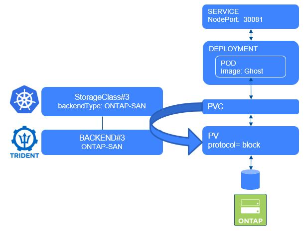

#########################################################################################
# SCENARIO 6: Create your first SAN backends 
#########################################################################################

**GOAL:**   
You understood how to create backends and what they are for.  
You probably also created a few ones with NFS drivers.  
It is now time to add more backends that can be used for block storage.  

:boom: **In order to go through this scenario, you first need to configure iSCSI on the ONTAP backend.** :boom:  
If not done so, please refer to the [Addenda5](../../Addendum/Addenda05).  



## A. Create your first SAN backends

You will find in this directory a few backends files:
- backend-san-default.json        ONTAP-SAN
- backend-san-eco-default.json    ONTAP-SAN-ECONOMY  

You can decide to use all of them, only a subset of them or modify them as you wish

:boom: **Here is an important statement if you are planning on using these drivers in your environment.** :boom:  
The **default** is to use **all data LIF** IPs from the SVM and to use **iSCSI multipath**.  
Specifying an IP address for the **dataLIF** for the ontap-san* drivers forces the driver to **disable** multipath and use only the specified address.  

If you take a closer look to both json files, you will see that the parameter dataLIF has not been set, therefore enabling multipathing.  

```
# tridentctl -n trident create backend -f backend-san-default.json
+-------------+----------------+--------------------------------------+--------+---------+
|    NAME     | STORAGE DRIVER |                 UUID                 | STATE  | VOLUMES |
+-------------+----------------+--------------------------------------+--------+---------+
| SAN-default | ontap-san      | ad04f63c-592d-49ae-bfde-21a11db06976 | online |       0 |
+-------------+----------------+--------------------------------------+--------+---------+

# tridentctl -n trident create backend -f backend-san-eco-default.json
+-----------------+-------------------+--------------------------------------+--------+---------+
|      NAME       |  STORAGE DRIVER   |                 UUID                 | STATE  | VOLUMES |
+-----------------+-------------------+--------------------------------------+--------+---------+
| SAN_ECO-default | ontap-san-economy | 530f18b1-680b-420f-ad6b-94c96fea84b9 | online |       0 |
+-----------------+-------------------+--------------------------------------+--------+---------+

# kubectl get -n trident tridentbackends
NAME        BACKEND               BACKEND UUID
...
tbe-7nl8v   SAN_ECO-default       530f18b1-680b-420f-ad6b-94c96fea84b9
tbe-wgs99   SAN-default           ad04f63c-592d-49ae-bfde-21a11db06976
...
```

## B. Create storage classes pointing to each new backend

You will also find in this directory a few storage class files.
You can decide to use all of them, only a subset of them or modify them as you wish

```
# kubectl create -f sc-csi-ontap-san.yaml
storageclass.storage.k8s.io/storage-class-san created

# kubectl create -f sc-csi-ontap-san-eco.yaml
storageclass.storage.k8s.io/storage-class-san-economy created
```

If you have configured Grafana, you can go back to your dashboard, to check what is happening (cf http://192.168.0.63:30001).

## C. What's next

Now, you have some SAN Backends & some storage classes configured. You can proceed to the creation of a stateful application:  
- [Scenario07](../Scenario07): Deploy your first app with Block storage  

Or go back to the [FrontPage](https://github.com/YvosOnTheHub/LabNetApp)