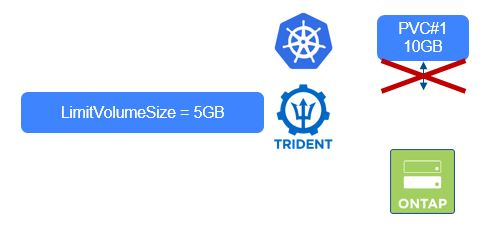

#########################################################################################
# SCENARIO 8: Consumption control: Trident parameters
#########################################################################################

You have two options to control space within Trident:

- Backend parameter _limitVolumeSize_
- Backend parameter _limitAggregateUsage_

## A. Limiting the size of the volumes on a SVM

One parameter stands out in the Trident configuration when it comes to control sizes: _limitVolumeSize_  
https://netapp-trident.readthedocs.io/en/stable-v20.07/dag/kubernetes/storage_configuration_trident.html#limit-the-maximum-size-of-volumes-created-by-trident  
Depending on the driver, this parameter will

1. control the PVC Size (ex: driver ONTAP-NAS)
2. control the size of the ONTAP volume hosting PVC (ex: drivers ONTAP-NAS-ECONOMY or ONTAP-SAN-ECONOMY)



Let's create a backend with this parameter setup (limitVolumeSize = 5g), followed by the storage class that points to it, using the storagePools parameter:

```bash
$ tridentctl -n trident create backend -f backend-nas-limitvolsize.json
+------------------+----------------+--------------------------------------+--------+---------+
|       NAME       | STORAGE DRIVER |                 UUID                 | STATE  | VOLUMES |
+------------------+----------------+--------------------------------------+--------+---------+
| NAS_LimitVolSize | ontap-nas      | 8b94769a-a759-4840-b936-985a360f2d87 | online |       0 |
+------------------+----------------+--------------------------------------+--------+---------+

$ kubectl create -f sc-backend-limit-volume.yaml
storageclass.storage.k8s.io/sclimitvolumesize created
```

Let's see the behavior of the PVC creation, using the pvc-10Gi-volume.yaml file.

```bash
$ kubectl create -f pvc-10Gi-volume.yaml
persistentvolumeclaim/10gvol created

$ kubectl get pvc
NAME      STATUS    VOLUME                                  CAPACITY   ACCESS MODES   STORAGECLASS        AGE
10gvol    Pending                                                                     sclimitvolumesize   10s
```

The PVC will remain in the _Pending_ state. You need to look either in the PVC logs or Trident's

```bash
$ kubectl describe pvc 10gvol
Name:          10gvol
Namespace:     default
StorageClass:  sclimitvolumesize
Status:        Pending
Volume:
Labels:        <none>
Annotations:   volume.beta.kubernetes.io/storage-provisioner: csi.trident.netapp.io
Finalizers:    [kubernetes.io/pvc-protection]
Capacity:
Access Modes:
VolumeMode:    Filesystem
Mounted By:    <none>
Events:
  Type     Reason                Age                    From                                                                                     Message
  ----     ------                ----                   ----                                                                                     -------
  Normal   Provisioning          2m32s (x9 over 6m47s)  csi.trident.netapp.io_trident-csi-6b778f79bb-scrzs_7d29b71e-2259-4287-9395-c0957eb6bd88  External provisioner is provisioning volume for claim "default/10gvol"
  Normal   ProvisioningFailed    2m32s (x9 over 6m47s)  csi.trident.netapp.io                                                                    encountered error(s) in creating the volume: [Failed to create volume pvc-19b8363f-23d6-43d1-b66f-e4539c474063 on storage pool aggr1 from backend NAS_LimitVolSize: requested size: 10737418240 > the size limit: 5368709120]
  Warning  ProvisioningFailed    2m32s (x9 over 6m47s)  csi.trident.netapp.io_trident-csi-6b778f79bb-scrzs_7d29b71e-2259-4287-9395-c0957eb6bd88  failed to provision volume with StorageClass "sclimitvolumesize": rpc error: code = Unknown desc = encountered error(s) in creating the volume: [Failed to create volume pvc-19b8363f-23d6-43d1-b66f-e4539c474063 on storage pool aggr1 from backend NAS_LimitVolSize: requested size: 10737418240 > the size limit: 5368709120]
  Normal   ExternalProvisioning  41s (x26 over 6m47s)   persistentvolume-controller                                                              waiting for a volume to be created, either by external provisioner "csi.trident.netapp.io" or manually created by system administrator
```

The error is now identified...  
You can decide to review the size of the PVC, or you can next ask the admin to update the Backend definition in order to go on.

Let's clean up before moving to the last chapter of this scenario.

```bash
$ kubectl delete pvc 10gvol
persistentvolumeclaim "10gvol" deleted
$ kubectl delete sc sclimitvolumesize
storageclass.storage.k8s.io "sclimitvolumesize" deleted
$ tridentctl -n trident delete backend NAS_LimitVolSize
```

## B. Limiting the usage of an aggregate

The second parameter you can set in a Trident backend allows the admin to limit the used space of an aggregate.  
More details on this link: https://netapp-trident.readthedocs.io/en/stable-v20.07/kubernetes/operations/tasks/backends/ontap/ontap-nas/configuration.html?highlight=limitAggregateUsage#backend-configuration

Please note that:

- It does not refer to the space used only by Trident, but really the overall space (example: limit set to 50%, aggregate already filled up to 45% by a virtualized environment: 5% left for Trident)
- **It requires CLUSTER ADMIN credentials**

Let's first look at how much space is used in the _aggr1_ aggregate

```bash
$ ssh -l admin 192.168.0.101 df -A -h -aggregate aggr1
Aggregate                total       used      avail capacity
aggr1                     76GB       29GB       47GB      38%
aggr1/.snapshot             0B         0B         0B       0%
2 entries were displayed.
```

As you can see, there are 38% of the 76GB currently used. Let's set the limit to 40GB.  
If you need a higher limit, you can edit the backend-nas-limitaggr.json file.  

```bash
$ tridentctl -n trident create backend -f backend-nas-limitaggr.json
+------------------+----------------+--------------------------------------+--------+---------+
|       NAME       | STORAGE DRIVER |                 UUID                 | STATE  | VOLUMES |
+------------------+----------------+--------------------------------------+--------+---------+
| NAS_LimitAggr    | ontap-nas      | bc5a6a76-1f17-44cc-a514-cd9dd083463b | online |       0 |
+------------------+----------------+--------------------------------------+--------+---------+

$ kubectl create -f sc-backend-limit-aggr.yaml
storageclass.storage.k8s.io/sclimitaggr created
```

Side note, in order to prove my point, I use Thick Provisioning as a default parameter.  
Let's now see the behavior of the PVC creation, using the pvc-10Gi-aggr.yaml file.

```bash
$ kubectl create -f pvc-10Gi-aggr.yaml
persistentvolumeclaim/10gaggr created

$ kubectl get pvc
NAME      STATUS    VOLUME                                  CAPACITY   ACCESS MODES   STORAGECLASS    AGE
10gaggr   Pending                                                                     sclimitaggr     10s
```

The PVC will remain in the _Pending_ state. You need to look either in the PVC logs or Trident's

```bash
$ kubectl describe pvc 10gaggr
Name:          10gaggr
Namespace:     default
StorageClass:  sclimitaggr
Status:        Pending
Volume:
Labels:        <none>
Annotations:   volume.beta.kubernetes.io/storage-provisioner: csi.trident.netapp.io
Finalizers:    [kubernetes.io/pvc-protection]
Capacity:
Access Modes:
VolumeMode:    Filesystem
Mounted By:    <none>
Events:
  Type     Reason                Age                From                                                                                     Message
  ----     ------                ----               ----                                                                                     -------
  Normal   Provisioning          12s (x5 over 25s)  csi.trident.netapp.io_trident-csi-7f4f878c58-6whlb_3118ff8e-4be0-448d-8f20-2701166c6bc7  External provisioner is provisioning volume for claim "default/10gaggr"
  Normal   ProvisioningFailed    11s (x5 over 25s)  csi.trident.netapp.io                                                                    encountered error(s) in creating the volume: [Failed to create volume pvc-771ff3fa-9809-4c06-a6ec-56381ddf065b on storage pool aggr1 from backend NAS_LimitAggr: backend cannot satisfy create request for volume trident_pvc_771ff3fa_9809_4c06_a6ec_56381ddf065b: (ONTAP-NAS pool aggr1/aggr1; error: aggregate usage of 51.24 %!w(MISSING)ould exceed the limit of 40.00 %!(NOVERB))]
  Warning  ProvisioningFailed    11s (x5 over 25s)  csi.trident.netapp.io_trident-csi-7f4f878c58-6whlb_3118ff8e-4be0-448d-8f20-2701166c6bc7  failed to provision volume with StorageClass "sclimitaggr": rpc error: code = Unknown desc = encountered error(s) in creating the volume: [Failed to create volume pvc-771ff3fa-9809-4c06-a6ec-56381ddf065b on storage pool aggr1 from backend NAS_LimitAggr: backend cannot satisfy create request for volume trident_pvc_771ff3fa_9809_4c06_a6ec_56381ddf065b: (ONTAP-NAS pool aggr1/aggr1; error: aggregate usage of 51.24 %!w(MISSING)ould exceed the limit of 40.00 %!(NOVERB))]
  Normal   ExternalProvisioning  9s (x3 over 25s)   persistentvolume-controller                                                              waiting for a volume to be created, either by external provisioner "csi.trident.netapp.io" or manually created by system administrator

```

The error is now identified...  
You can decide to review the size of the PVC, or you can next ask the admin to update the Backend definition in order to go on.  

Let's clean up before moving to the last chapter of this scenario.

```bash
$ kubectl delete pvc 10gaggr
persistentvolumeclaim "10gaggr" deleted
$ kubectl delete sc sclimitaggr
storageclass.storage.k8s.io "sclimitaggr" deleted
$ tridentctl -n trident delete backend NAS_LimitAggr
```

## C. What's next

You can now move on to the next section of this chapter: [ONTAP parameters](../3_ONTAP_parameters)

Or go back to the [FrontPage](https://github.com/YvosOnTheHub/LabNetApp)