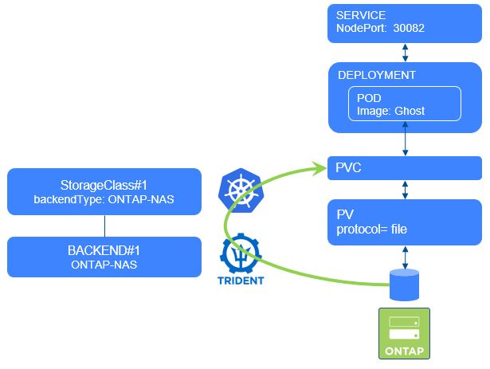

#########################################################################################
# SCENARIO 8: Use the import feature of Trident
#########################################################################################

GOAL:  
Trident allows you to import a volume sitting in a NetApp backend into Kubernetes.
We will first copy the volume we used in the [Scenario05](../Scenario05), import it, and create a new Ghost instance



## A. Identify & copy the volume on the NetApp backend.

The full name of the volume is available in the PV metadata.
You can retrieve it if with the 'kubectl describe' command, or use the following (note how to use the jsonpath feature!)

```
# kubectl get pv $( kubectl get pvc blog-content -n ghostnas -o=jsonpath='{.spec.volumeName}') -o=jsonpath='{.spec.csi.volumeAttributes.internalName}{"\n"}'
nas1_pvc_e24c99b7_b4e7_4de1_b952_a8d451e7e735
```

Now that you know the full name of the volume, you can copy it. This copy will be done in 2 stages (clone & split)
Open Putty, connect to "cluster1" and finally enter all the following:
```
# vol clone create -flexclone to_import -vserver svm1 -parent-volume nas1_pvc_e24c99b7_b4e7_4de1_b952_a8d451e7e735
# vol clone split start -flexclone to_import
```
In this example, the new volume's name is 'to_import'


## B. Import the volume

In the 'Ghost' directory, you will see some yaml files to build a new 'Ghost' app.
Open the PVC definition file, & notice the difference with the one used in the scenario5.
```
# tridentctl -n trident import volume NAS_Vol-default to_import -f Ghost/1_pvc.yaml
+------------------------------------------+---------+-------------------+----------+--------------------------------------+--------+---------+
|                   NAME                   |  SIZE   |   STORAGE CLASS   | PROTOCOL |             BACKEND UUID             | STATE  | MANAGED |
+------------------------------------------+---------+-------------------+----------+--------------------------------------+--------+---------+
| pvc-ac9ba4b2-7dce-4241-8c8e-a4ced9cf7dcf | 5.0 GiB | storage-class-nas | file     | dea226cf-7df7-4795-b1a1-3a4a3318a059 | online | true    |
+------------------------------------------+---------+-------------------+----------+--------------------------------------+--------+---------+

# kubectl get pvc -n ghostnas
NAME                  STATUS   VOLUME                                     CAPACITY   ACCESS MODES   STORAGECLASS        AGE
blog-content          Bound    pvc-e24c99b7-b4e7-4de1-b952-a8d451e7e735   5Gi        RWX            storage-class-nas   19h
blog-content-import   Bound    pvc-ac9ba4b2-7dce-4241-8c8e-a4ced9cf7dcf   5Gi        RWX            storage-class-nas   21m
```

Notice that the volume full name on the storage backend has changed to respect the CSI specifications:
```
# kubectl get pv $( kubectl get pvc blog-content-import -n ghostnas -o=jsonpath='{.spec.volumeName}') -o=jsonpath='{.spec.csi.volumeAttributes.internalName}{"\n"}'
nas1_pvc_ac9ba4b2_7dce_4241_8c8e_a4ced9cf7dcf
```

Even though the name of the original PV has changed, you can still see it if you look into its annotations.
```
# kubectl describe pvc blog-content-import -n ghostnas | grep importOriginalName
               trident.netapp.io/importOriginalName: to_import
```

## C. Create a new Ghost app.

You can now create the deployment & expose it on a new port
```
# kubectl create -n ghostnas -f Ghost/2_deploy.yaml
deployment.apps/blogimport created
# kubectl create -n ghostnas -f Ghost/3_service.yaml
service/blogimport created

# kubectl all -n ghostnas
NAME                           READY   STATUS    RESTARTS   AGE
pod/blog-cd5894ddd-d2tqp       1/1     Running   0          20h
pod/blogimport-66945d9-bsw9b   1/1     Running   0          24m

NAME                 TYPE       CLUSTER-IP       EXTERNAL-IP   PORT(S)        AGE
service/blog         NodePort   10.111.248.112   <none>        80:30080/TCP   20h
service/blogimport   NodePort   10.104.52.17     <none>        80:30082/TCP   24m

NAME                         READY   UP-TO-DATE   AVAILABLE   AGE
deployment.apps/blog         1/1     1            1           20h
deployment.apps/blogimport   1/1     1            1           24m

NAME                                 DESIRED   CURRENT   READY   AGE
replicaset.apps/blog-cd5894ddd       1         1         1       20h
replicaset.apps/blogimport-66945d9   1         1         1       24m
```


## D. Access the app

The Ghost service is configured with a NodePort type, which means you can access it from every node of the cluster on port 30082.
Give it a try !
=> http://192.168.0.63:30082


## E. Cleanup

Instead of deleting each object one by one, you can directly delete the namespace which will then remove all of its objects.

```
# kubectl delete ns ghostnas
namespace "ghostnas" deleted
```
