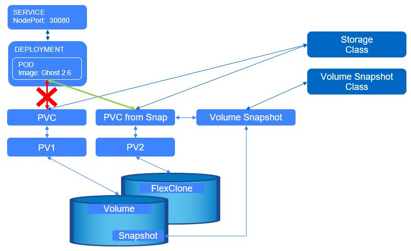

#########################################################################################
# SCENARIO 14.1: In-place PVC restore
#########################################################################################

"Oh zut! I deleted some very important data from my PVC!!!"  
"No worries, you can reuse the CSI Snapshot you created earlier without contacting the Infra teams"



To *restore* data, you can edit the object that defines that Application (in our case, a *deployment*) or patch it:

```bash
$ kubectl patch -n ghost deploy blog -p '{"spec":{"template":{"spec":{"volumes":[{"name":"content","persistentVolumeClaim":{"claimName":"mydata-from-snap"}}]}}}}'
deployment.apps/blog patched
```

That will trigger a new POD creation with the updated configuration:

```bash
$ kubectl get -n ghost pod
NAME                    READY   STATUS        RESTARTS   AGE
blog-5c9c4cdfbf-q986f   1/1     Terminating   0          5m22s
blog-57cdf6865f-ww2db   1/1     Running       0          6s
```

Now, if you look at the files this POD has access to (the PVC), you will see that the *lost data* (file: test.txt) is back!

```bash
$ kubectl exec -n ghost blog-57cdf6865f-ww2db -- ls /data/test.txt
-rw-r--r--    1 root     root             0 Jun 30 11:34 /data/test.txt
```

Tadaaa, you have restored your data!  
Keep in mind that some applications may need some extra care once the data is restored (databases for instance).  

## Optional Cleanup (only to run if you are done with *snapshots* & *clones*)

```bash
$ kubectl delete ns ghost
namespace "ghost" deleted
```

## What's next

You can now move on to:

- [Scenario14_2](../2_Clone_for_new_app): Use snapshots for in place restore  
- [Scenario14_3](../3_what_happens_when): Don't be afraid  

Or go back to:

- the [Scenario14 FrontPage](../)
- the [GitHub FrontPage](https://github.com/YvosOnTheHub/LabNetApp)